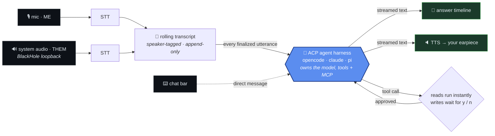

# earpiece

  

A real-time "voice of god" assistant for your Mac. Start it with a mission — *"help me in
this sales discussion"*, *"help me with this tech trivia"* — and it listens to your
**microphone** and your **system audio** (the other side of the call, a video, a meeting),
keeps a live speaker-tagged transcript, and streams back guidance as **live text** and
optionally as **voice in your earpiece**.

It behaves like a real-time participant, not a batch chatbot. Every time someone finishes a
sentence — you or the other side — it answers, and you can also **type a message straight to
it** in the chat bar. Answers come from a coding-agent harness ([opencode](https://opencode.ai),
[Claude Code](https://www.anthropic.com/claude-code), [pi](https://pi.dev), Gemini CLI, …)
speaking the [Agent Client Protocol](https://agentclientprotocol.com), so the assistant can
create a JIRA ticket from the conversation, run a web search, or use any MCP tool — with a
y/n confirmation gate before anything that mutates state. If the conversation moves on
mid-answer, the in-flight answer is cancelled mid-sentence and replaced.

- **Bring your own agent** — any ACP harness works (`opencode acp`,
  `npx @zed-industries/claude-code-acp`, `gemini --experimental-acp`, `npx pi-acp`); the
  harness brings its own model endpoint and tools. See [Choosing an agent harness](#choosing-an-agent-harness).
- **Type to it** — an always-on chat bar forwards your message straight to the agent, in the
  same session as the live conversation
- **Tools with a leash** — the harness's tools (incl. any MCP servers it's configured with)
  run read-only instantly; writes (tickets, files, shell) pause for your `y`/`n`
- **Fast streaming STT** — [Deepgram](https://deepgram.com) by default (low latency); a local
  whisper fallback (any OpenAI-compatible `/audio/transcriptions` endpoint, Docker included)
  for offline use, at the cost of higher latency
- **Speaker attribution without diarization** — mic and system audio are separate capture
  channels, so utterances are tagged `ME` / `THEM` for free
- **Natural interruption** — when a new utterance arrives mid-answer, the stale answer is
  cancelled at the next word, queued speech is flushed, and the agent turn is cancelled over
  the protocol
- **Barge-in** — the moment you speak, voice output pauses; it never talks over you
- **Shared-mode mic capture** — Zoom/Meet/games keep full use of the same microphone
- **Local-friendly** — whisper in Docker and a harness like opencode/pi pointed at your own
  vLLM/Ollama endpoint

## Quick start

```sh
brew install blackhole-2ch          # one-time: system-audio loopback (see Setup below)

git clone https://github.com/ViktorWelbers/earpiece && cd earpiece
uv tool install --editable .        # installs the `earpiece` command on your PATH

earpiece configure                  # interactive setup, stored in ~/.config/earpiece/
earpiece run "help me with tech trivia"
```

Talk, or play something with speech — the left pane fills with the transcript, the right
pane streams timestamped answers, and the chat bar at the bottom is always ready for you to
type a message to the agent.

## How it works



earpiece is the audio frontend; the **responder is an external agent harness** spawned as a
subprocess and driven over the [Agent Client Protocol](https://agentclientprotocol.com). Each
finalized utterance (from either channel) starts an answer turn that forwards the new
transcript lines; the harness owns the model, the tools, and the conversation context, and
streams the answer back. The same path serves the **chat bar**: anything you type is sent as a
direct message into the same agent session.

Tool calls show up in the answers timeline (`⚙ create_ticket(...)`); anything that isn't
read-only pauses with a status-bar banner until you press `y` or `n` (30 s ⇒ denied). Every
new utterance is evaluated against the partial answer in flight — if one is still streaming,
it's cancelled over the protocol, unspoken TTS is dropped, the history gets an `[interrupted]`
marker, and a fresh turn starts on the latest line.

The harness keeps the conversation context in its own session; each turn earpiece forwards
only the transcript lines since the previous one, so it needs no model client of its own.
That session is **compressed and reopened every 25 turns** (`AGENT_SESSION_TURNS`): left to
run, a session eventually stops answering the transcript and starts *continuing* it —
inventing the next `THEM:` line and replying to itself — so earpiece asks the outgoing
session to brief its successor and seeds a fresh one with that summary. You'll see a brief
pause between turns when it rotates.
Full design doc: [AGENTS.md](AGENTS.md).

## Setup

### 1. Install

Requires macOS, Python 3.12+, and [uv](https://docs.astral.sh/uv/).

```sh
uv tool install --editable .   # `earpiece` command tracking this checkout (recommended)
# or: uv tool install .        # frozen copy; re-run with --reinstall after edits (the
#                              #   version is pinned, so uv may otherwise serve a cached build)
# or: pipx install .           # same idea via pipx
# or: uv sync                  # dev environment only; run via `uv run earpiece`
```

### 2. System-audio loopback (one-time)

Capturing "the other side" needs a loopback device:

```sh
brew install blackhole-2ch
```

Then in **Audio MIDI Setup** (`/Applications/Utilities`):

1. `+` → **Create Multi-Output Device**
2. Check **your real output** (speakers / earpiece) **and** **BlackHole 2ch**
3. Set the system output device to this Multi-Output Device

You hear everything normally; earpiece records the BlackHole side. Without this, only the
mic channel works.

> **Routing rule for `--voice`:** the TTS output device (`--output-device`, e.g. your
> earbuds) should **not** be part of the Multi-Output Device — otherwise the people you're
> talking to hear the assistant. (A software guard mutes the `THEM` capture channel while
> TTS plays — plus a 1s tail — so the assistant won't transcribe itself either way.)

### 3. Configure

```sh
earpiece configure
```

An interactive wizard: the agent harness command and the STT engine. Answers are stored in
`~/.config/earpiece/config.toml`. Running `earpiece run` without any configuration offers
the wizard automatically.

The file uses the same names as the environment variables, and **env vars override the
file**, so one-off overrides stay easy:

```toml
# ~/.config/earpiece/config.toml
AGENT_CMD = "opencode acp"             # the ACP harness that answers (and acts)
EARPIECE_STT = "deepgram"              # default: fast streaming STT (recommended)
DEEPGRAM_API_KEY = "..."
# local fallback instead of Deepgram (no cloud, but higher latency):
#   EARPIECE_STT = "whisper"
#   STT_BASE_URL = "http://localhost:8001/v1"
#   STT_MODEL = "Systran/faster-whisper-small"
```

> **Deepgram free credit:** at the time of writing, signing up gives **$200 in free credit** —
> plenty to run earpiece for a long while. See [deepgram.com/pricing](https://deepgram.com/pricing).

The harness must be set up on its own once and supplies the model that actually answers —
earpiece just spawns `AGENT_CMD` and speaks ACP to it. **Tools and MCP servers are configured
in the harness** (opencode, Claude Code, …), not in earpiece; earpiece only surfaces the
harness's tool calls and gates writes behind your `y`/`n`. earpiece itself needs **no LLM
config**: the only model in the loop lives inside the harness.

Optional keys: `AGENT_CWD` to pin the harness's working directory,
`AGENT_AUTO_TOOLS = "jira_search*,lookup_*"` (comma-separated globs) to let specific
non-read-only tools run without confirmation, `AGENT_SESSION_TURNS` (default `25`, `0`
disables) to tune how often the harness session is compressed and reopened,
`DEEPGRAM_API_KEY` for `--stt deepgram`,
`STT_API_KEY` for hosted whisper endpoints, and `EARPIECE_MIC_DEVICE` /
`EARPIECE_SYSTEM_DEVICE` / `EARPIECE_OUTPUT_DEVICE` to pin audio devices (index or name
substring; the matching CLI flags override). `EARPIECE_CONFIG=/path/to/file.toml` relocates
the config file. `earpiece configure show` prints the effective configuration and where
each value comes from.

### Choosing an agent harness

`AGENT_CMD` is a shell-style command line; earpiece spawns it and speaks ACP over its
stdio. Each harness is configured (model, auth, tools) **in the harness itself** — earpiece
never sees its model choice. Examples:

```toml
# opencode — uses whatever model you've configured in ~/.config/opencode/opencode.json
AGENT_CMD = "opencode acp"

# Claude Code — via Zed's ACP adapter (needs Claude Code installed + authenticated)
AGENT_CMD = "npx @zed-industries/claude-code-acp"

# Gemini CLI — needs the gemini CLI installed and authenticated
AGENT_CMD = "gemini --experimental-acp"

# pi — needs a provider/model configured in pi
AGENT_CMD = "npx pi-acp"
```

Setup notes per harness:

- **opencode** — `brew install sst/tap/opencode` (or see opencode docs), then
  `opencode auth login` or define providers in `~/.config/opencode/opencode.json`.
  `opencode acp` starts the ACP server on stdio; earpiece uses opencode's default model.
- **Claude Code** — install Claude Code and sign in; the `@zed-industries/claude-code-acp`
  adapter bridges it to ACP. `npx` fetches the adapter on first run.
- **Gemini CLI** — install `gemini` and authenticate; `--experimental-acp` exposes the ACP
  server.
- **pi** — install pi and configure a provider/model; it then speaks ACP for earpiece.

Use an absolute path (`AGENT_CMD = "/full/path/to/opencode acp"`) if the binary isn't on the
`PATH` that launches earpiece. If `AGENT_CMD` is wrong or the harness isn't set up, earpiece
fails fast at startup with `agent harness error: …` rather than on the first answer.

> Harness commands and adapter package names evolve — check each project's ACP docs for the
> current invocation. `opencode acp` is the configuration this project is tested against.

## Whisper STT (offline fallback)

**Deepgram is the default and what you want for realtime use** — its streaming endpoint is
markedly lower-latency. Whisper is the fallback for when you can't use the cloud: it runs
locally but finalizes noticeably slower, so expect more lag before answers.

To use it, run whisper in a local Docker container ([speaches](https://speaches.ai), CPU
image, OpenAI-compatible `/v1/audio/transcriptions` on `localhost:8001`) and set
`EARPIECE_STT = "whisper"` with `STT_BASE_URL` / `STT_MODEL`. (For a fully offline setup,
also point your agent harness at a local model — that's the harness's concern, not
earpiece's.)

```sh
# needs Docker Desktop / OrbStack running; reads ~/.config/earpiece/config.toml
scripts/run-local.sh "help me with tech trivia" --voice say

# env vars override the config file for one-off runs:
STT_MODEL=Systran/faster-distil-whisper-large-v3 \
scripts/run-local.sh "help me in this sales discussion"
```

The script is just convenience around `docker compose -f local/docker-compose.yml up -d`
plus a one-time whisper-model install — once the container is running, a plain
`earpiece run "..."` works too.

Notes:

- Docker on macOS is CPU-only, so finalization is slow; `Systran/faster-whisper-small` (the
  default) is the least-laggy option. Bigger models = better accuracy, slower still.
- The whisper backend endpoints locally (energy VAD) and posts each finished segment as a
  WAV only after you stop speaking — meaningfully higher latency than Deepgram's streaming
  endpoint. Use Deepgram unless you specifically need to stay offline.
- Stop the whisper container with `docker compose -f local/docker-compose.yml down`.

## Usage

```sh
# list audio devices (find your mic / loopback / earpiece indices)
earpiece devices

# text-only; answers every finalized utterance, type to it in the chat bar
earpiece run "help me in this sales discussion"

# speak answers into the earpiece as well
earpiece run "help me with this tech trivia" --voice say

# explicit devices (two-mic setup: mic 6 feeds earpiece, you reply on another mic)
earpiece run "..." --mic-device 6 --system-device BlackHole --output-device 1
```

**The chat bar is always on.** Whatever you type goes there:

| Input | Effect |
|---|---|
| *type text* + `Enter` | send the message straight to the agent |
| empty `Enter` | answer now over the latest transcript (push-to-ask) |
| `y` / `n` | approve / deny a pending tool call (while one is waiting) |
| `/mute` | mute the mic |
| `/voice` | toggle voice output |
| `/quit` | quit (Ctrl-C also works) |

**The status bar** shows channel health (mic / sys / stt / voice), the last decision and its
reason, prompt-cache usage — and any error, so failures are never silent (details land in
`earpiece.log`). When the agent wants to run a non-read-only tool, the status bar switches to
a yellow `confirm: <tool> — press y to run, n to deny` banner and the answers pane shows the
pending action (`⏸`), then its outcome (`⚙` running, `✓` done, `✗` denied/failed).

> earpiece answers on **every** finalized utterance from both channels, so in a real
> two-party call it can be chatty (and each turn is a full harness turn). It shines for solo
> use — quizzing, narration, "I'll talk, you give me sidenotes" — and for trivia. Use the
> chat bar when you want to drive it deliberately instead of letting it react.

### Microphone sharing

Capture is **shared mode** — other apps (Zoom, Meet, games) keep full use of the same mic
while earpiece listens. For hard separation, use two mics via `--mic-device`.

## Development

```sh
uv sync
uv run pytest          # unit tests (no audio hardware, no network)
uv run ruff check .    # lint
uv run earpiece run "..." --debug-dump-wav   # dump captured audio to debug_audio/*.wav
```

When developing, install with `uv tool install --editable .` so the `earpiece` command runs
this checkout directly (a plain `uv tool install .` makes a frozen copy and, because the
version is pinned at `0.1.0`, may reuse a cached build — add `--reinstall` to force a
rebuild). Logs go to `earpiece.log` (`-v` for debug). Architecture and design rationale live
in [AGENTS.md](AGENTS.md). STT and TTS engines are small registries
(`src/earpiece/stt/`, `src/earpiece/output/tts/`) — adding an engine is one module with a
`@register` decorator.

## A note on consent

Recording calls may require the other party's consent depending on your jurisdiction.
This tool is for assisting **your own** conversations — know your local rules.
